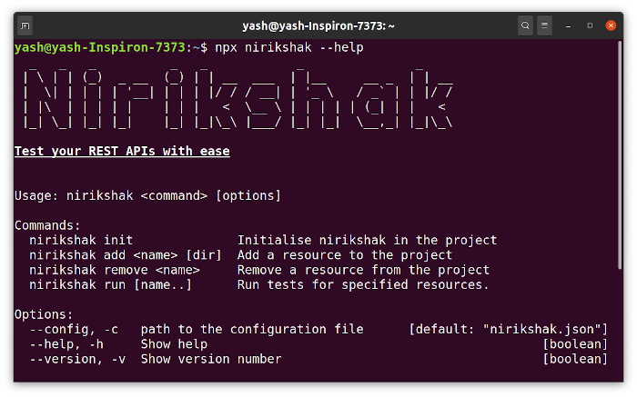

# 
Nirikshak

Test your REST APIs with ease

 

## Introduction

<!-- TODO: add screenshot -->

Nirikshak is a REST API testing framework. It leverages the REST semantics and provides autonomous testing. That means you get to kick back and relax while we do all the hard work for you.

**_Disclaimer: The project is still in infancy and is limited in scope and capabilities. But you can extend the framework to suit your needs. For more, read on._**

## What exactly does it do?

Nirikshak generates test cases, runs them and analyses them for you. The flow can be summarised as below:

1.  It generates a generic suite of test cases on initialisation.
2.  You provide a description of your API to Nirikshak.
3.  It reads that description on runtime and links it to the test cases.
4.  It invokes [jest](https://jestjs.io/) to run your tests cases.
5.  It analyses the test log generated and provides you with a report.

## What is the scope of this tool?

Nirikshak works on APIs that:

1.  Are written in typescript
2.  Use JSON as their hypermedia format to expose data
3.  Perform CRUD operations on resources
4.  Follow REST standards

Nirikshak performs unit functional tests on them. At a glance, this seems very restrictive. But the best part is that the framework is extentsible. We expose the internal APIs that we use to make tests work. You can leverage them to write your own tests.

## Concepts

1. [Rest semantics and how we interpret them](docs/REST.md)
2. [Possible outcomes to a request](docs/Cases.md)
3. [Request relationship graph](docs/Graph.md)
4. [Flow of testing](docs/TestFlow.md)
5. [Data analysis](docs/DataAnalysis.md)

## API Reference

1. [@nirikshak/cli](packages/cli/README.md): CLI tool that manages tests for your project
2. [@nirikshak/core](packages/core/README.md): Core logic that makes tests work
3. [@nirikshak/reporter](packages/reporter/README.md): Jest reporter that generates reports for you
