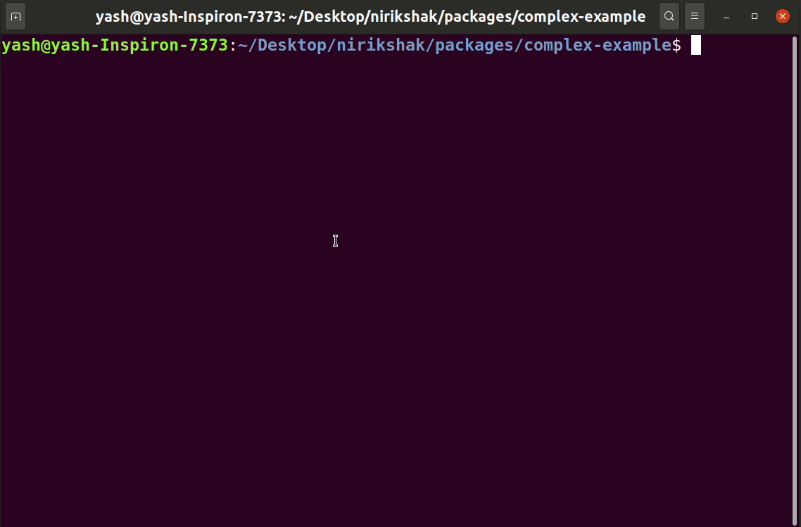

# Adding a resource

You cannot directly add a resource. Instead, you need to use the `add` command. It performs a few checks and then adds the resource.

To add a resource, run the command. That will create the directory structure necessary for the new resource. To know what steps are taken, read the [resource addition reference](../packages/cli/docs/Add.md).

```shell
npx nirikshak add <resource-name> [dir]
```

<p align=center>
    
</p>
