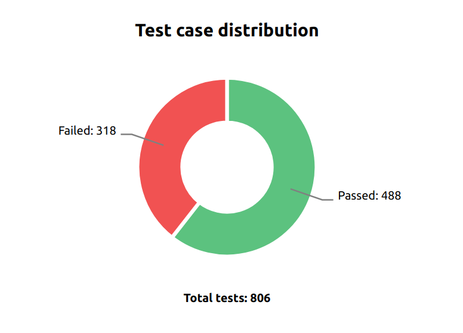
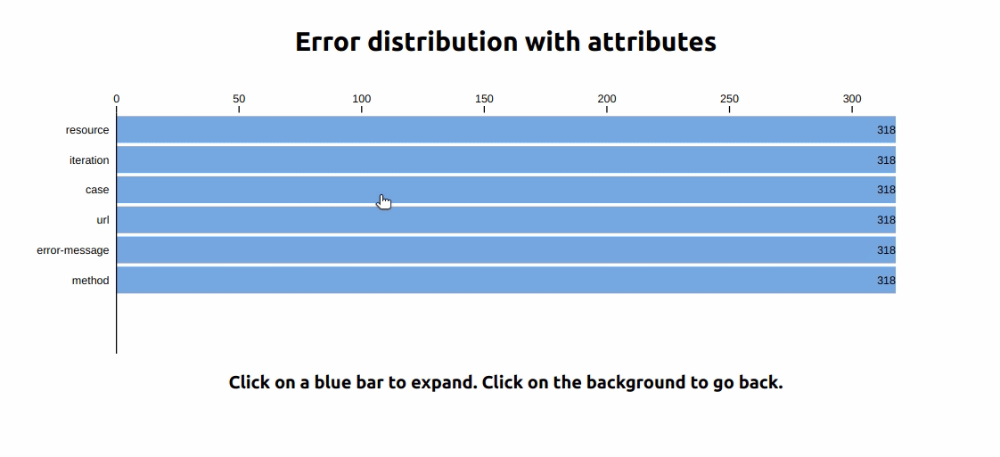
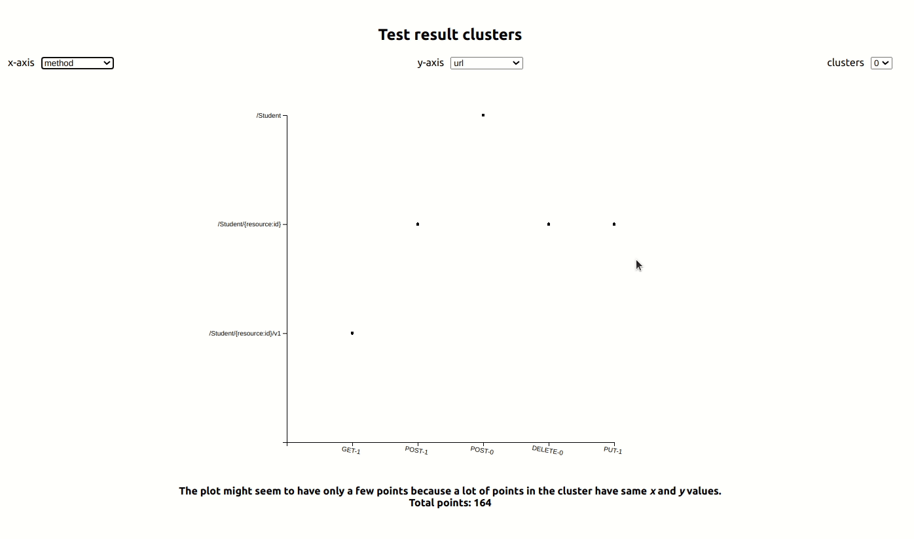

# Data analysis

This section covers all the steps we take to analyse your data logs. These are rudimentary and will improve over time

## Analysis steps

The first step we take is to check out the number of total and failed tests. Based on that we proceed. Following is the flow of analysis:

1. No test : No analysis
2. If there are any tests, we make a record of passed and failed tests. That is available in the form of a donut chart.
3. If there are any failed tests, we perform heirarchical grouping of your data.
4. If the failed tests are more than 100, we perform clustering.

## Test ratio

We keep a ratio of passed to failed tests.

## Data points

First off, we filter the log to find failed tests. From each test entry, we extract the following attributes:

1. Test case outcome
2. Method - type and index
3. Resource name
4. Url
5. Iteration
6. Error message

## Heirachical grouping

We create a heirarchical distribution over the attributes. For example: Case ("Positive", "Negative", "Destructive") -> method entry for each case -> ..... and so on. That is available as a heirachial bar graph. We only perform grouping if there are any failed tests.

## Clustering

We perform clustering on 5 attributes (we do not consider iteration). To know about the clustering algorithm, see API docs and usage.
 

