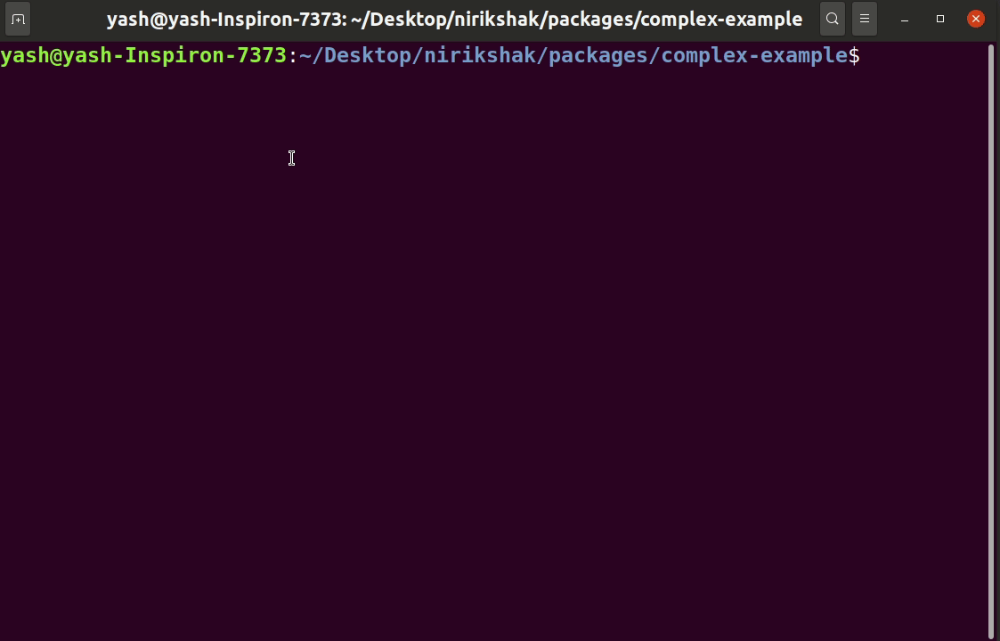

# Initialisation

To work we Nirikshak, you need to initialise your project. In order to do so, you need to take the following steps:

## 1. Writing a configuration file

A Nirikshak configuration file is used to keep track of your directory structure. Following is an example of a basic configuration file

```json
{
    "dir": "__tests__",
    "resources": ["students"],
    "app": "app.ts"
}
```

1. **dir** is the name of folder we should use for testing purposes. That folder is created and the tests are stored there.
2. **resources** is an array of all the resources in your application.
3. **app** is the path to your server implementation.

You should save this file in the project root (or wherever the working directory is) under the name of `nirikshak.json`. To know more about configuration, read the [API reference](../packages/cli/docs/Configuration.md)

## 2. Run initialisation command

Run the initialisation command. That will create the directory structure necessary for Nirikshak. To know what files are created, read the API reference.

```shell
npx nirikshak init
```

<p align=center>
    
</p>
