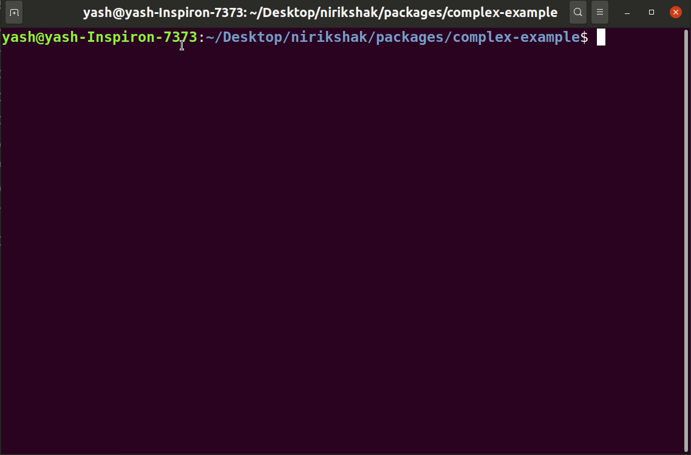

# Removing a resource

You cannot directly remove a resource. Instead, you need to use the `remove` command. It performs a few checks and then removes the resource.

To remove a resource, run the command. That will delete the selected resource from your project properly. To know what steps are taken, read the [resource removal reference](../packages/cli/docs/Remove.md).

```shell
npx nirikshak remove <resource-name>
```

<p align=center>
    
</p>
