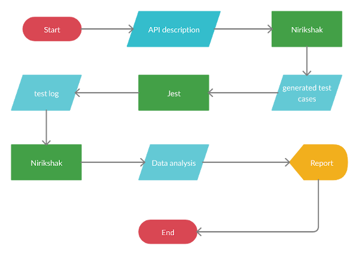

# Flow of testing

This section explains how we perform testing. This is a conceptual overview. For technical details, see usage and API reference. The aim of this section is to take everything discussed so far and show you how they fit in the test process

## Initialisation

When you initialise Nirikshak in your project, we prepare a directory structure and some stubs for you. For each resource, we make a directory with following files:

1. `config.json`: Parameters that control how many tests are generated
2. `helpers.ts`: Helper functions for resource generation, body validation, setup and cleanup.
3. `resource.json`: An empty json file where you write your resource description
4. `endpoints.json`: An empty json file where you write your endpoints and their description
5. `[resourceName].test.ts`: The file containing test suite for the resource

After you fill in the stubs, you are ready to go. To see which stub to fill and how, see usage and API reference.

## Setup

We generate tests for each resource separately, in its own directory. For each test suite (Collection of tests for a resource), we provide a `setup` stub in helper functions. By default, it generates a certain number of resource instances from the `resource.json` description. The number is decided by `config.json -> setupInstances` value. It then takes those instances and adds them to our collection.

We assume that before the tests run, your application has all these resource instances with it. That is, collection and the state of your application are in sync. We expect you to take necessary actions to add those resource to your application within the `setup` function.

## Cleanup

We provide a cleanup stub. It gives you access to the final collection which you can use to remove the resource instances from your application. By default, this stub does nothing.

## Validations

Before every test, we perform validations on `resource.json` and `endpoints.json`. You can see these happening at the beginning of the `[resource].test.ts` file. Currently, we can only tell if the schemas are valid. We cannot find errors in schemas. Future version of the tool will include a parser that will be able to do this.

## Request graph and traversal

Now this is where the things get interesting. We read your `endpoints.json` file and generate request relationship graph for your API. Following steps are taken:

### Node generation

We break your API description into distinct points which act as nodes of our request traversal graph. Every node contains the following information:

1. **Method**: Get, Put, Post, Patch or Delete
2. **Outcome case**: Positive, Negative or Desctructive
3. **Method index**: The index of entry among similar methods. For example, if you have two ways to `get` a resouce instance, we recognise them by giving them indices 0 and 1. This entry refers to that index. If there is only one entry for a method, corresponding node has method index 0.
4. **Input data**: The data format to be used to hit the API. This includes headers, query string and body if any
5. **Output data**: Data format of expected output from the API. This includes headers, status an body if any.

To identify a node, we need the method, method index, the case. If we know all this, we can identify a node from your description. We encode this data in a string that is used as an identifier for the node. We use this identifier to index a hash map that stores that data described above.

## Graph generation

When we have a map of node name (encoded node identifier) and corresponding data, we move on to making a graph. We use node names to label the nodes. We then go on to add egdes to the graph. Edges are hardcoded into our graph generation algorithm.

## Graph traversal

This is the core of our test generation. We have a parameter called steps that is available from `config.json`. We take the graph generated and traverse it in the following way: 
1. Generate all walks of `steps` vertices from every node
2. That is available as an array of array of strings. Inner array of strings are the nodes on a walk. Outer array is the collection of those walks.
3. We iterate over each walk. From every walk, we visit a node one by one. When we visit a node, we perform the appropriate testing actions.

# Before every walk

The first thing we do is create a server instance with supertest. It takes a randomly available port and starts the server on it. We also perform the setup over here. We also pick an instance 

# Traversing each node

We extract the information for the node from the map using the node name. We generate the API input and then hit the API with it. We also update our collection accordingly.

